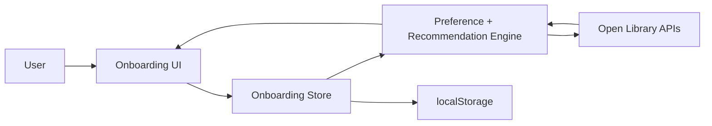

# openlibrary-onboarding

Mentor-ready onboarding UX prototype for Open Library with a real integration layer and implementation mapping.

## Quick Start

```bash
npm install
npm run dev
```

Open `http://localhost:5173`.

## Scripts

- `npm run dev` - start Vite dev server
- `npm run build` - production build
- `npm run preview` - preview production build
- `npm run lint` - run ESLint
- `npm run lint:css` - run Stylelint
- `npm run test` - run unit tests

If browser tests fail on first run, install Playwright browser binaries:

```bash
npx playwright install
```

## Open Library Integration Plan

Current prototype already integrates Open Library APIs through [`src/services/api.js`](src/services/api.js):

- Subjects source:
  - `https://openlibrary.org/subjects.json?limit={n}`
- Recommendations source:
  - `https://openlibrary.org/subjects/{subject}.json?limit={n}&details=true`
  - `https://openlibrary.org/search.json?q={query}&limit={n}`
- Book detail source:
  - `https://openlibrary.org/works/{workId}.json`

Fallback behavior for reliability:

- If API calls fail, use local curated fallback subjects/books.
- Cold-start flow (no preferences selected) returns popular books via a fiction fallback.
- Imported titles are filtered out from recommendations.

State persistence:

- User onboarding state is stored in `localStorage` via [`src/services/storage.js`](src/services/storage.js).
- Persisted fields: step, subjects, preferences, imported books, recommendations, completion flag.

## Architecture



## Component and File Mapping

Core UI modules:

- [`src/components/ol-preference-selector.js`](src/components/ol-preference-selector.js)
- [`src/components/ol-import-dialog.js`](src/components/ol-import-dialog.js)
- [`src/components/ol-recommendation-preview.js`](src/components/ol-recommendation-preview.js)
- [`src/components/ol-book-card.js`](src/components/ol-book-card.js)
- [`src/components/ol-onboarding-step.js`](src/components/ol-onboarding-step.js)
- [`src/components/ol-button.js`](src/components/ol-button.js)

Flow controller and state:

- [`src/main.js`](src/main.js)
- [`src/store/onboarding-store.js`](src/store/onboarding-store.js)

Proposed Open Library integration touchpoints:

- `openlibrary/templates/account/register.html` (replace/augment sign-up onboarding region)
- `openlibrary/templates/home/index.html` (post-onboarding recommendation entry points)
- Frontend JS bundle entry where onboarding bootstrap is initialized

Detailed mapping notes are in [`docs/openlibrary-integration.md`](docs/openlibrary-integration.md).

## Data Flow and Edge Cases

Data flow summary:

1. Preferences step loads subjects from Open Library.
2. User-selected preferences + imported books are stored in store and persisted.
3. Recommendations step fetches ranked books from subject/search APIs.
4. Homepage displays recommended or imported books.

Handled edge cases:

- No preferences: use popular books fallback.
- API failure/timeouts: switch to local fallback catalog.
- Duplicate titles: deduplicated before rendering.
- Imported titles in recommendations: filtered out.

## Why This Matters to Open Library

- Reduces new-user friction during sign-up.
- Improves first-session book discovery.
- Provides a clear extension point for personalization.
- Aligns with Open Library mission: accessible and engaging reading for everyone.

## Demo Assets

Prototype wireframes/screenshots are in [`docs/wireframes`](docs/wireframes).

