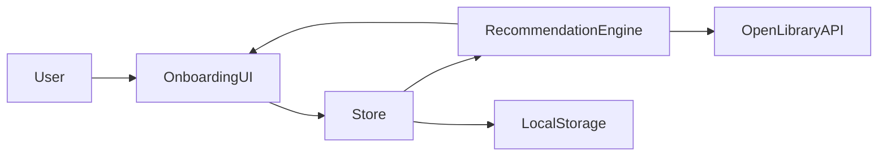

# Library-Onboarding

Mentor-format implementation repo for an Open Library onboarding improvement project.

## 1. Open Library Integration Layer

Implemented in [`src/services/api.js`](src/services/api.js):

- Subjects:
  - `GET https://openlibrary.org/subjects.json?limit={n}`
- Recommendations:
  - `GET https://openlibrary.org/subjects/{subject}.json?limit={n}&details=true`
  - `GET https://openlibrary.org/search.json?q={query}&limit={n}`
- Book details:
  - `GET https://openlibrary.org/works/{workId}.json`

Fallback strategy:

- API failure -> local fallback catalog.
- Cold start (`preferences.length === 0`) -> popular books fallback.
- Imported titles are filtered from recommendation output.

Persistence:

- Local state stored in `localStorage` via [`src/services/storage.js`](src/services/storage.js).

## 2. Architecture



## 3. Components

UI components:

- [`src/components/ol-preference-selector.js`](src/components/ol-preference-selector.js)
- [`src/components/ol-import-dialog.js`](src/components/ol-import-dialog.js)
- [`src/components/ol-recommendation-preview.js`](src/components/ol-recommendation-preview.js)
- [`src/components/ol-book-card.js`](src/components/ol-book-card.js)
- [`src/components/ol-onboarding-step.js`](src/components/ol-onboarding-step.js)
- [`src/components/ol-button.js`](src/components/ol-button.js)

Flow/state:

- [`src/main.js`](src/main.js)
- [`src/store/onboarding-store.js`](src/store/onboarding-store.js)

Pages:

- [`src/pages/welcome-page.js`](src/pages/welcome-page.js)
- [`src/pages/preferences-page.js`](src/pages/preferences-page.js)
- [`src/pages/import-books-page.js`](src/pages/import-books-page.js)
- [`src/pages/recommendations-page.js`](src/pages/recommendations-page.js)
- [`src/pages/homepage.js`](src/pages/homepage.js)

## 4. Feature Depth

Implemented depth expected by mentors:

- Dynamic subject loading from Open Library.
- Preference-aware recommendations.
- Cold-start recommendation path.
- Multi-source fallback (subject -> search -> popular -> local fallback).
- Deduplication and imported-title filtering.
- Persisted onboarding state.

## 5. Open Library File Mapping (Proposed)

Integration touchpoints:

- `openlibrary/templates/account/register.html`
- `openlibrary/templates/home/index.html`
- Frontend JS entry where account/onboarding bootstrap is initialized

Detailed notes:

- [`docs/openlibrary-integration.md`](docs/openlibrary-integration.md)

## 6. Why This Matters to Open Library

- Reduces drop-off at first account experience.
- Improves immediate book discovery quality.
- Increases engagement for new users.
- Keeps discovery aligned with Open Library accessibility goals.

## 7. Demo and Prototype Assets

- Wireframes/screenshots:
  - [`docs/wireframes`](docs/wireframes)

## 8. Proposal-Ready Doc

- GSoC proposal format draft:
  - [`docs/selected-level-proposal.md`](docs/selected-level-proposal.md)

## Development

```bash
npm install
npm run dev
```

Verification:

```bash
npm run lint
npm run build
npm run test
```
